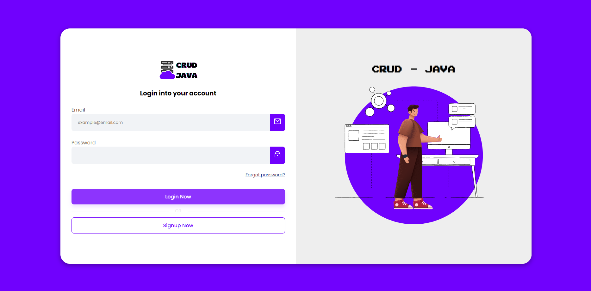

<h1 align="center" style="font-weight: bold;">Login Page example in Angular</h1>

<p align="center">
 <a href="#about">About</a> • 
 <a href="#started">Getting Started</a> • 
  <a href="#routes">App Routes</a> • 
</p>

<p align="center">
    
</p>

<h2 id="about">📌 About</h2>

This project is a simple Login and Registration application developed in Angular with authentication and backend integration. 

[Reference video](https://youtu.be/6qbuuPM_de4)

<h2 id="started">🚀 Getting started</h2>

<h3>Prerequisites</h3>

- [NodeJS](https://nodejs.org/)
- [Git](https://git-scm.com)
- [Angular CLI](https://angular.io/cli)

<h3>Cloning</h3>


```bash
git clone https://github.com/ygorportes/crud-frontend.git
```

<h3>Starting</h3>

```bash
cd project-name
npm run start
```

<h2 id="routes">📍 Application Routes</h2>

| route                | description                                          
|----------------------|-----------------------------------------------------
| <kbd>/signup</kbd>   | Page to sign up
| <kbd>/login</kbd>    | Page to login
| <kbd>/user</kbd>     | Protected page that only logged in users can access